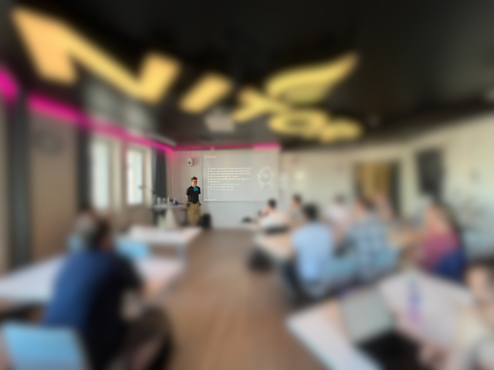
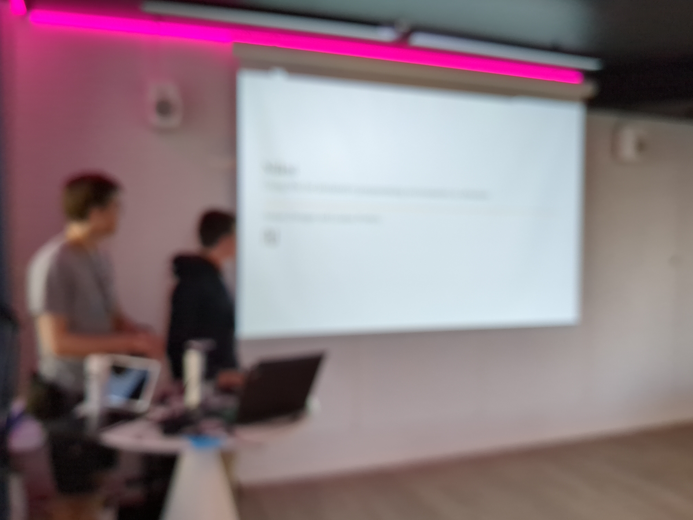
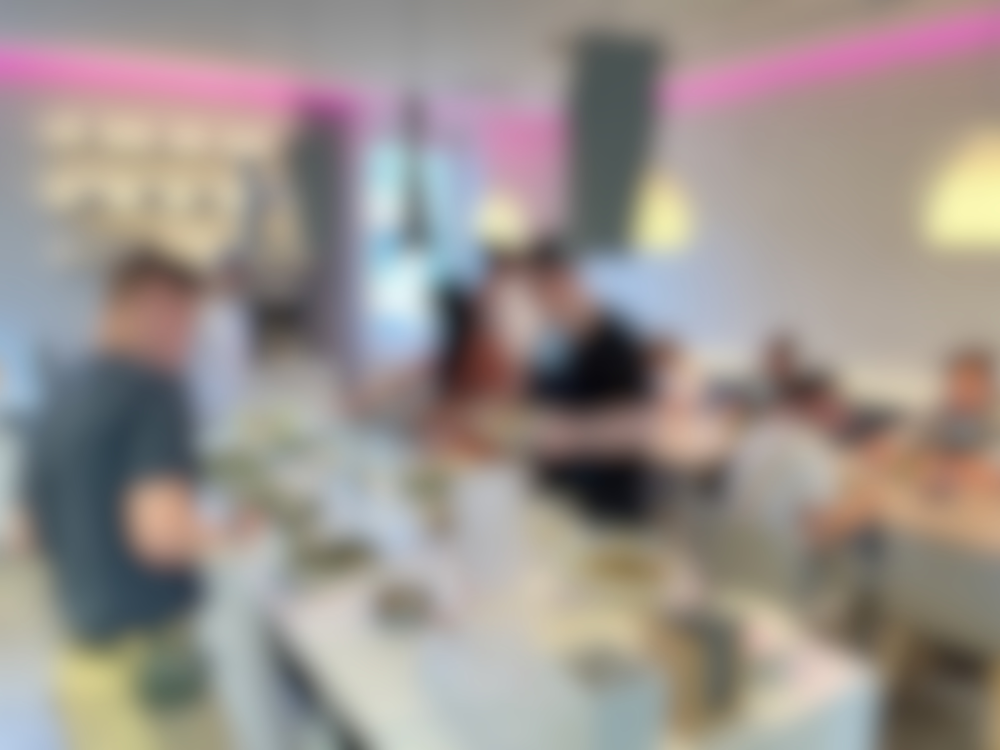
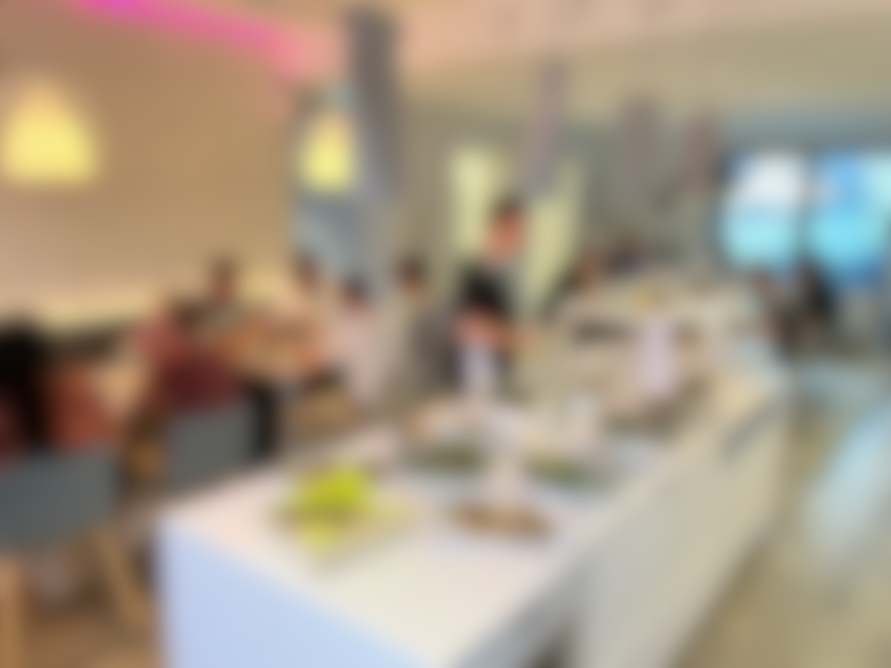
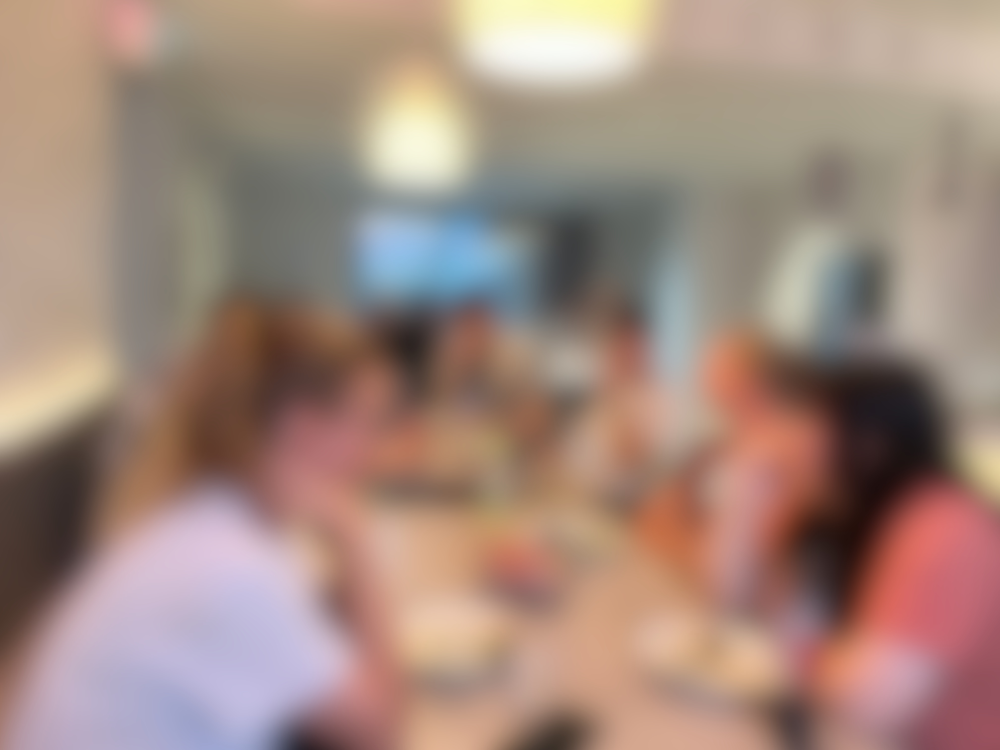
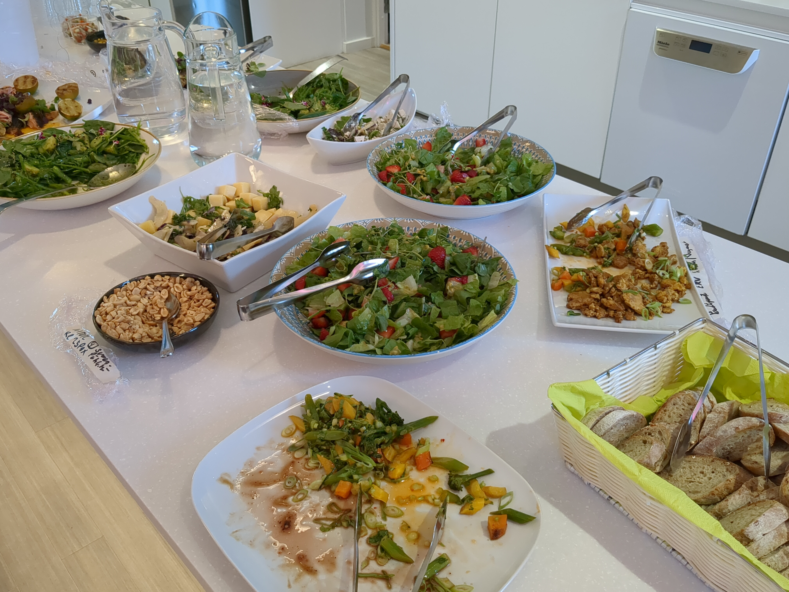
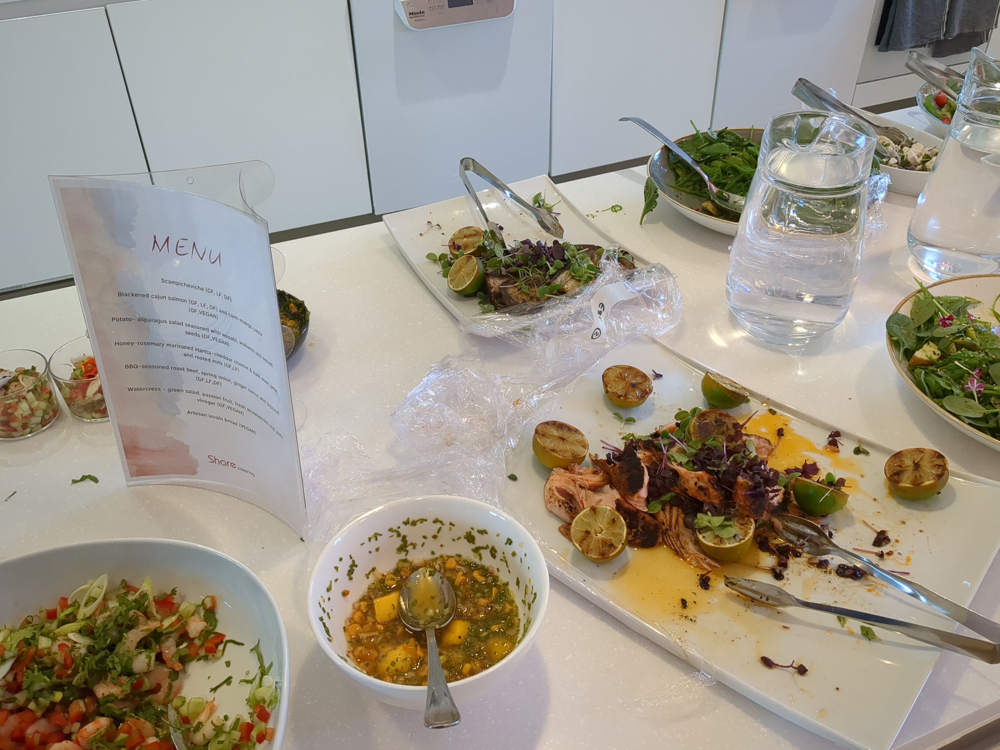

+++
title = "Nix Users Helsinki Meetup at Nitor"
date = "2024-08-28"
+++

It's finally happened! After an unsuccessful call in February'24[^callFebruary] and several months of gestation, thanks to perseverance of [Niklas H](https://discourse.nixos.org/u/niklash)[^callJuly] and the cooperation of our friend Jan at [Nitor](https://nitor.com), we've finally had our first meeting in Helsinki, and it's been a blast! We've had an amazing turnout of nineteen (19) hackers and spent some two-odd wonderful hours in talks and networking.

## Facts

- Attendees: 19.
- Location: Nitor office, Aleksanterinkatu 46, 00100 Helsinki.
- Recordings: no talks were recorded.

## Agenda

- "Introduction to Nix", a presentation by `@niklashh`, [link](https://gitlab.com/niklashh/nix-notes/-/blob/f394e67f0c8245fc3ab5a8fee15779e8c85df78e/slides/introduction-2024-08-28.typ).
- "k3s+NixOS homelab", a presentation by `@icy`, (link TBA).
- Dinner!
- "Niksi", a presentation by Matias Z and Luukas P, (link TBA).
- "Evanix: scheduling and constraints", a presentation by `@SomeoneSerge`, [link1](https://md.someonex.net/p/CLBCno20_#), also a [follow-up](https://youtu.be/8jgVeaLSJQc?list=PLgknCdxP89RdM2kYomMN0QTs67p7VVlRa&t=1967).
- "Nix Events: Sprints, UGs, and 'Cons", a presentation by `@SomeoneSerge`, [link](https://md.someonex.net/p/nRJYbWEoF#/6).
- Retro: feedback collected [in the pad](https://md.someonex.net/iNMk8JrmSnGYNcK8aIqyrw?view#Feedback) and offline. The most recurring item was the need for regular meetings in a persistent location.

## Future plans

- Office hours, possibly co-locating with Otanix on Aalto University's campus.
- Next Nix meetup could be at [Monad](https://monad.fi/) at Tampere

## Photography

Pictures were collected during the event. Attendees were offered an opportunity to review and erase their imagery, but we could still do a better job at ensuring that all photography is taken in a consensual way, as well as at explicitly communicating how the images may be used and redistributed. In particular, since we haven't collected the consents for redistribution in advance and since we do not know every one by name, we're yet to find a way to figure which pictures we may publish in this announcement. Additionally, we've screwed our "OpSec" by transferring some of the pictures unencrypted over Telegram.

[^callFebruary]: [https://discourse.nixos.org/t/nix-meetup-in-helsinki/40195](https://discourse.nixos.org/t/nix-meetup-in-helsinki/40195)
[^callJuly]: [https://discourse.nixos.org/t/nix-meetup-helsinki/48211](https://discourse.nixos.org/t/nix-meetup-helsinki/48211)
